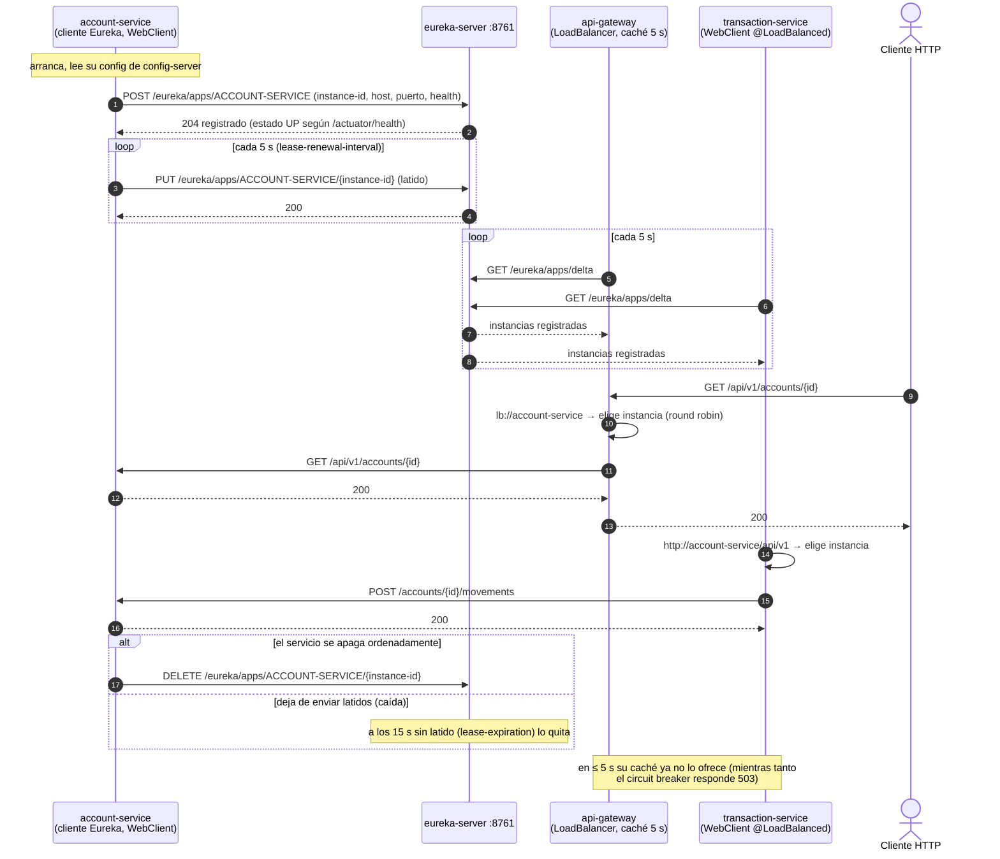

# Secuencia — Registro, latidos y descubrimiento en Eureka

Implementado por `eureka-server` (`@EnableEurekaServer`, puerto 8761) y por el cliente de Eureka de
cada servicio (`bank-config/application.yml`). Lo prueban `RegistrationTest` (registro, listado y
baja por REST) y, en vivo, el panel de `http://localhost:8761`.

## Notas

- **Nombres, no puertos.** Los `base-url` de los clientes son `http://<servicio>/api/v1`; el puerto
  real lo da Eureka. Levantar una segunda instancia (otro puerto) la incorpora sola al balanceo.
- **Dos `WebClient.Builder`.** El `@LoadBalanced` es solo para llamar a otros servicios; el cliente
  de Eureka usa el builder normal (`@Primary`) para hablar con `localhost:8761`.
- **Health real.** `eureka.client.healthcheck.enabled=true`: si Mongo cae, la instancia queda `DOWN`
  y deja de recibir tráfico (Redis no cuenta, es solo caché).
- **Sin réplica de Eureka** en el bootcamp (`register-with-eureka=false`, `fetch-registry=false` en el
  servidor); en producción serían dos o tres nodos que se replican.
